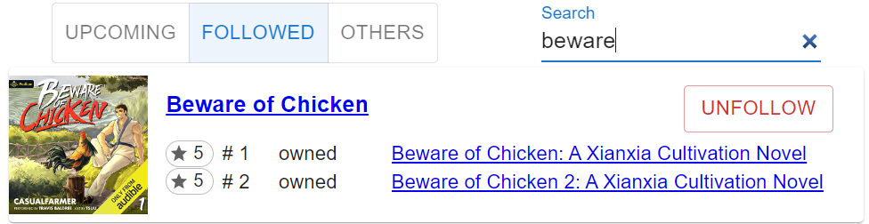
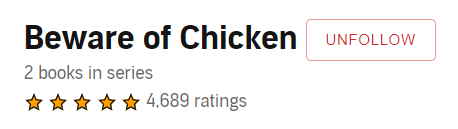

# What does it do?

A chrome extension to allow you to follow series you like on Audible.

## Upcoming 


## Followed and Other series


## Audible series page unfollow


## Functionality 

This extension will:
* let you see what's upcoming for your followed series
* occasionally poll each of your followed series to update its list
* provide a view for upcoming books, your followed series, and your other series
* allow you to follow and unfollow a series on the Audible series page
* notify you of new releases in your followed series

New series will be automatically followed if they have a book within the past 5 years that you've rated 4+.

### Options
You can set the Audible base url (eg https://www.audible.com) in the extension options.

# Troubleshooting
Chrome extensions consist of two parts: the background stuff, and the browser stuff.
The developer console should show everything for both of them.

## The background stuff
The background is where we talk to Audible so we can know about your books.
We'll store your books and series data in `chrome.storage.local`.
Clearing this will cause us to get all of your books and series info again.

We store what you're following in `chrome.storage.sync`, which can travel between computers.

To see the developer tools console for the background stuff, right-click on the extension icon and
select "Manage Extension", then click on *Inspect Views > service worker*.

## The browser stuff
The browser is where we show you the data we got in the background.
This is where the "Upcoming", "Series", and "Others" tabs live.

To see info about the browser stuff, you'll want the Console, Network, and Elements tabs in the developer tools.

## Restarting the extension
You can restart the extension from the Chrome Extensions page: chrome://extensions/.

# How does it work?

Every 24 hours, the extension will attempt to get the series information from Audible without doing any extra authentication.
This means that if you aren't signed in to Audible, or if you can't access that page, it won't work.

It then parses the data from that page and tracks them all as books and series.  The extension page shows these books in card form.

## Tech stack
* [Solid](http://solidjs.com): Front end framework
* [SUID](https://suid.io/): UI component library
* [CRXJS](https://crxjs.dev/vite-plugin): Chrome extension [Vite](https://vitejs.dev/) plugin

# Making changes yourself
You can pull down this repository and make changes locally, then submit them as pull requests.
## Development environment requirements

### Install Node.js
You can install node using [Volta](http://volta.sh).

### Prettier IDE integration
Regardless of the code editor you use, you'll want to [set Prettier up](https://prettier.io/docs/en/editors.html) to run when you make changes to files.

## Pull down dependencies
```shell
npm install
```
## Start it up locally
```shell
npm start
```
## Load the extension into your browser
1. Open [Manage Extensions](chrome://extensions/)
2. Click `Load unpacked` and select the `dist` folder
3. Test it out

Now you're ready to start making changes!

# Notes
The icon was generated with https://favicon.io/favicon-generator/
