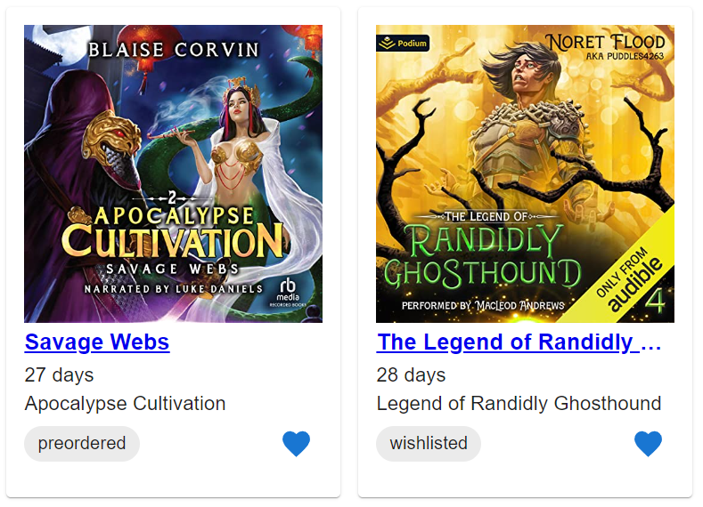
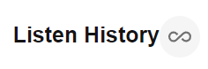

# What does it do?


A chrome extension to keep track of your listen history on Audible.

Audible only tracks a couple of months worth of listen history.  
This extension will extend that time frame to indefinitely, but it can only work
with the data it has.

It will occasionally poll Audible's [listen history page](https://www.audible.com/account/listen-history) 
to update its list.

On this listen history page in Audible, you see your full history by clicking on the infinity icon:



You can also open this in a popup by clicking on the extension icon  in your browser.

# How does it work?

Every 24 hours, the extension will attempt to get the listen history page from Audible without doing any extra authentication.
This means that if you aren't signed in to Audible, or if you can't access that page, it won't work.

It then parses the data from that page and tracks them all as a `Book`.  The extension page shows these books in card form.

## Tech stack
* [Solid](http://solidjs.com): Front end framework
* [SUID](https://suid.io/): UI component library
* [CRXJS](https://crxjs.dev/vite-plugin): Chrome extension [Vite](https://vitejs.dev/) plugin

# Making changes yourself
You can pull down this repository and make changes locally, then submit them as pull requests.
## Development environment requirements

### Install Node.js
You can install node using [Volta](http://volta.sh).

### Prettier IDE integration
Regardless of the code editor you use, you'll want to [set Prettier up](https://prettier.io/docs/en/editors.html) to run when you make changes to files.

## Pull down dependencies
```shell
npm install
```
## Start it up locally
```shell
npm start
```
## Load the extension into your browser
1. Open [Manage Extensions](chrome://extensions/)
2. Click `Load unpacked` and select the `dist` folder
3. Test it out

Now you're ready to start making changes!

# Notes
The icon was generated with https://favicon.io/favicon-generator/
