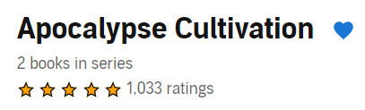

# What does it do?


A chrome extension to allow you to follow series you like on Audible.
  
This extension will let you see what's upcoming for your followed series.

It will occasionally poll each of your followed series to update its list.

On each series page in Audible, you will be able to follow or unfollow the series by clicking the heart icon:



# Options
You can set the Audible base url (eg https://www.audible.com) in the extension options.

# How does it work?

Every 24 hours, the extension will attempt to get the series information from Audible without doing any extra authentication.
This means that if you aren't signed in to Audible, or if you can't access that page, it won't work.

It then parses the data from that page and tracks them all as books and series.  The extension page shows these books in card form.

## Tech stack
* [Solid](http://solidjs.com): Front end framework
* [SUID](https://suid.io/): UI component library
* [CRXJS](https://crxjs.dev/vite-plugin): Chrome extension [Vite](https://vitejs.dev/) plugin

# Making changes yourself
You can pull down this repository and make changes locally, then submit them as pull requests.
## Development environment requirements

### Install Node.js
You can install node using [Volta](http://volta.sh).

### Prettier IDE integration
Regardless of the code editor you use, you'll want to [set Prettier up](https://prettier.io/docs/en/editors.html) to run when you make changes to files.

## Pull down dependencies
```shell
npm install
```
## Start it up locally
```shell
npm start
```
## Load the extension into your browser
1. Open [Manage Extensions](chrome://extensions/)
2. Click `Load unpacked` and select the `dist` folder
3. Test it out

Now you're ready to start making changes!

# Notes
The icon was generated with https://favicon.io/favicon-generator/
